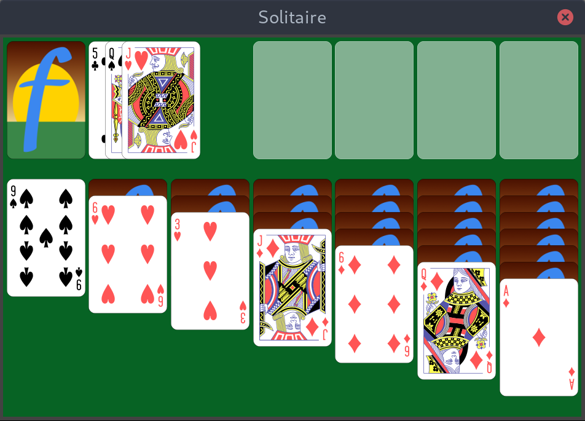

# Fyne Examples

Here we will gather example apps that use the [Fyne](http://fyne.io) toolkit.
This is a new repository and many existing examples can still be found
in the main Fyne repo at [https://github.com/fyne-io/fyne/tree/develop/examples].

All these examples are fully scalable - try setting the `FYNE_SCALE`
environment variable to override the detection of your screen's density.

## Solitaire

This is a work in progress

