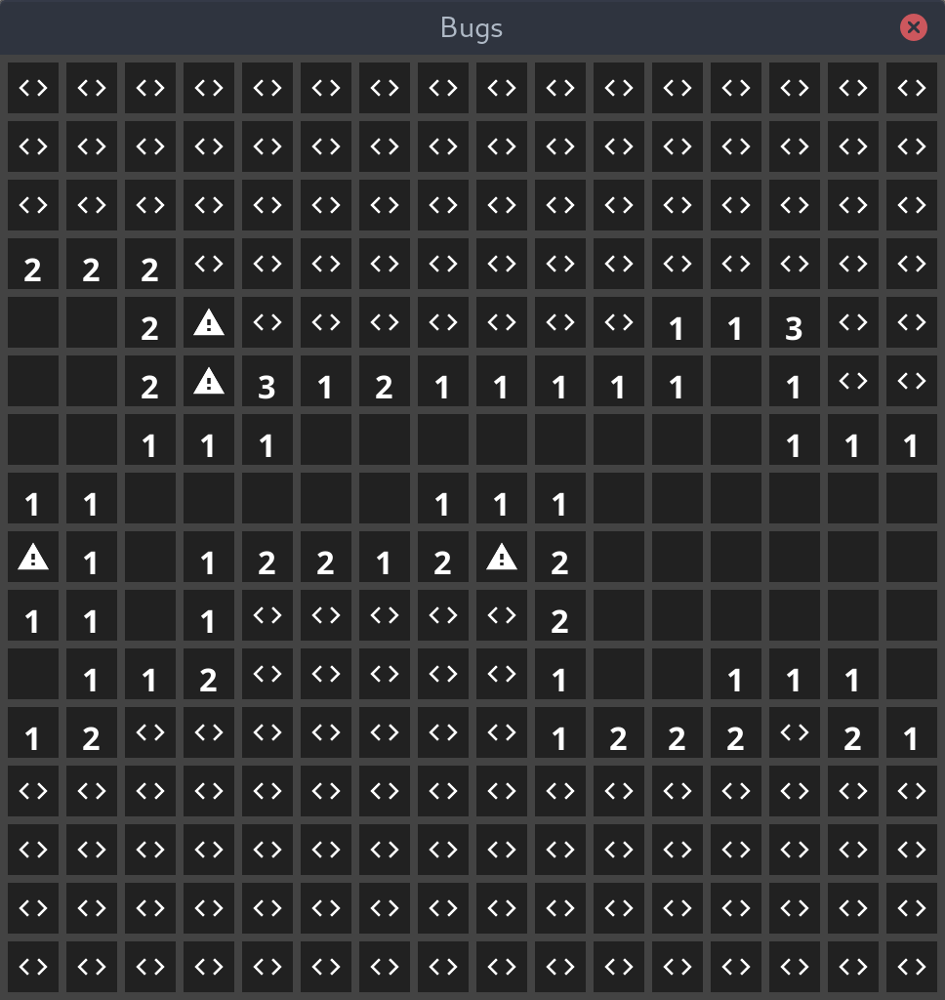
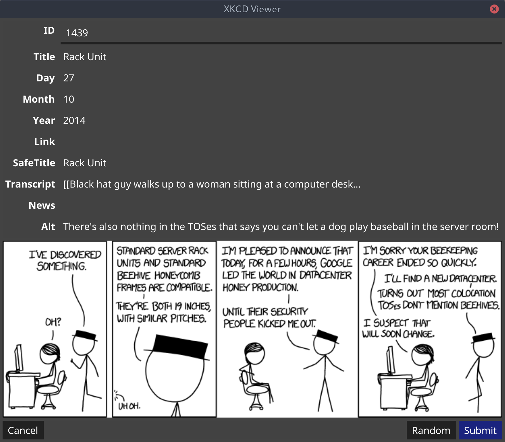
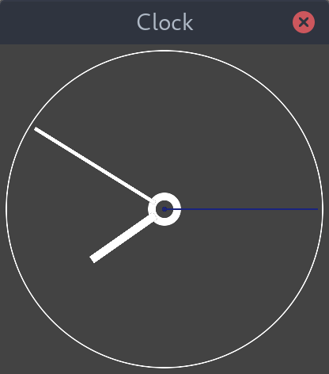
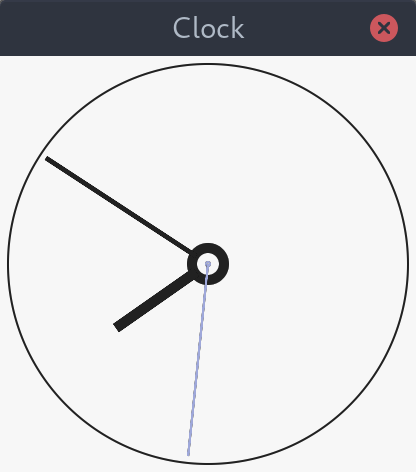
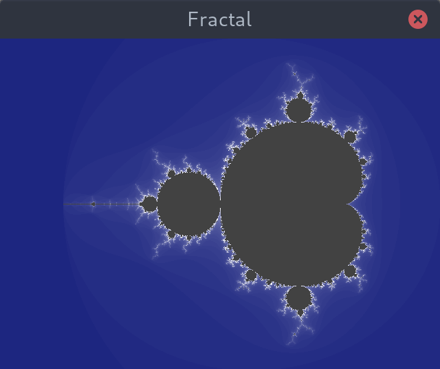

<p align="center">
  <a href="https://goreportcard.com/report/github.com/fyne-io/examples"></a>
  <a href='http://gophers.slack.com/messages/fyne'></a>
  <a href='https://fossfi.sh/support-fyneio'></a>

  <br />
  <a href="https://travis-ci.com/github/fyne-io/examples"></a>
  <a href='https://coveralls.io/github/fyne-io/examples?branch=develop'></a>
</p>

# Fyne Examples

Here we will gather example apps that use the [Fyne](http://fyne.io) toolkit.

You can start the main example app that links to all the others by running

```bash 
go run main.go
```

or you can specify a particular example by naming it in the parameter list, like:

```bash
go run main.go -fractal
```

Alternatively each app has a direct main executable in the cmd/* folders.

All these examples are fully scalable - try setting the `FYNE_SCALE`
environment variable to override the detection of your screen's density.
Many also respond to the current theme (this is default behaviour for
apps built using Fyne widgets) - you can try setting `FYNE_THEME=light`
to change from the default dark theme.

## Widget based examples

The following examples use mostly built in widgets making applications
trivial to build :).

### Calculator

Moved to [calculator repository](https://github.com/fyne-io/calculator/)

### Bugs game (like MineSweeper)

Hunt the squares to reveal everything apart from the bugs!



### XKCD

An XKCD comic browser with random and lookup features.



## Graphics based examples

These examples use the Fyne canvas API to draw primitive shapes,
text and images to create custom user interfaces.

### Clock

A simple analog clock that matches the current theme.

 &nbsp; 

### Fractal

A fractal viewer that can be panned and zoomed



### Solitaire

Moved to [solitaire repository](https://github.com/fyne-io/solitaire/)

### Life

Moved to [life repository](https://github.com/fyne-io/life/)
